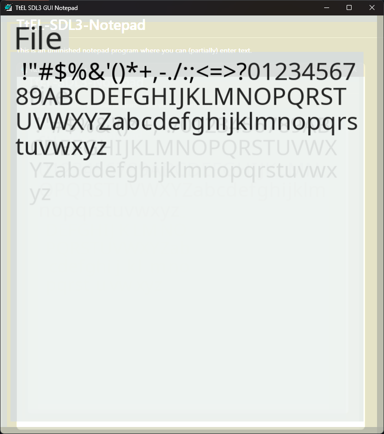

# TtEL-SDL3-Notepad
This is an unfinished notepad program where you can (partially) enter text.

  

## Building
Supply SDL extension libraries with their required external libraries. For example, SDL3_ttf requires you provide [freetype](https://github.com/freetype/freetype) and [harfbuzz](https://github.com/harfbuzz/harfbuzz).
Then, build SDL3 and all extension libraries using CMake.
Finally, build the Notepad using CMake.
